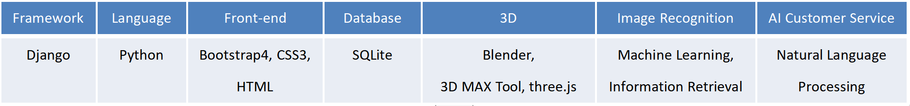
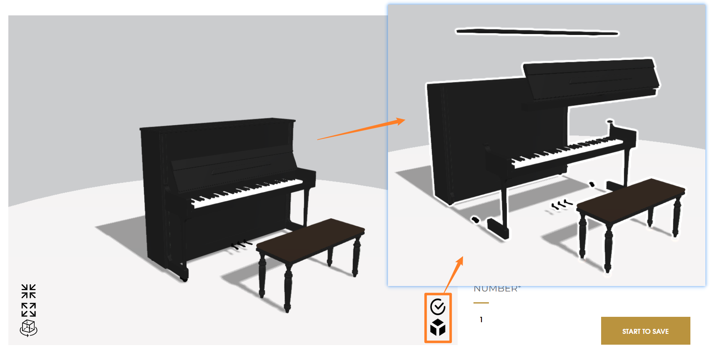
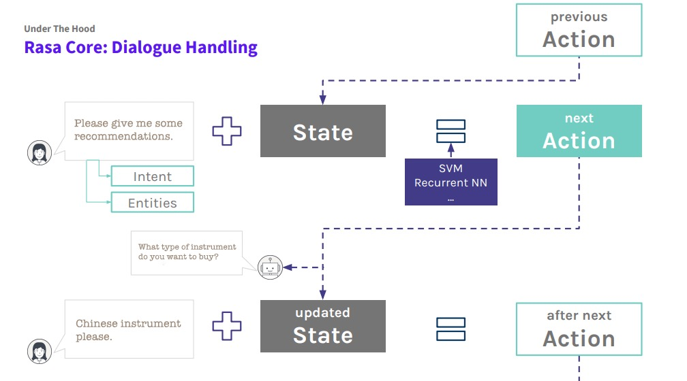
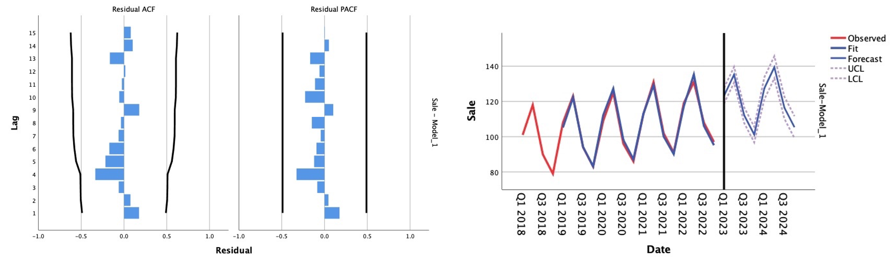
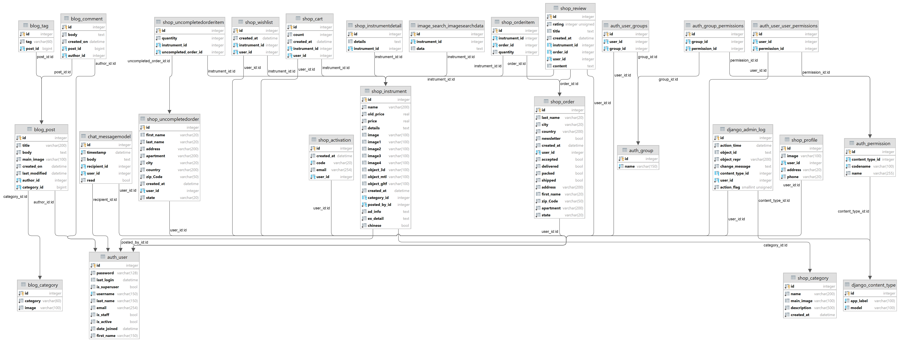
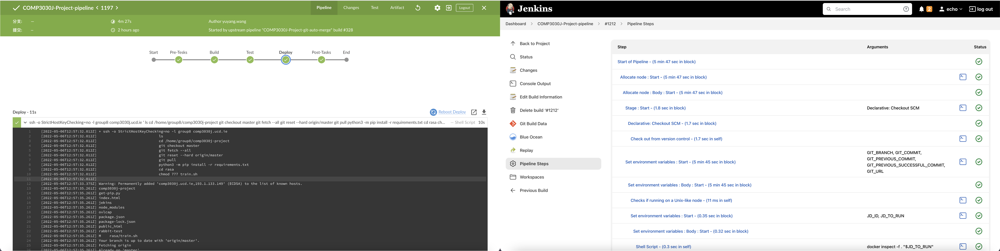

# COMP3030J-Musical-Instrument-Shop - Software Engineering Project 2021-2022
## Group 8: IllegalGroupNameException
Your software engineering team has been hired to meet the needs of a client, a local Musical Instrument Shop. This shop is family-owned and has sold musical instruments locally for years. All of their business to-date is walk-in retail customers.

# Start the project
### Update - Using docker-compose

```shell
git clone git@github.com:echo-cool/COMP3030J-Software-Engineering-Project-Musical-Instrument-Shop.git
cd COMP3030J-Software-Engineering-Project-Musical-Instrument-Shop/
docker-compose pull
docker-compose up -d
```

```shell
python3 -m pip install -r requirements.txt
python3 manage.py makemigrations
python3 manage.py migrate
python3 manage.py runserver 0.0.0.0:5008
```

# Abstract
Recent years have witnessed the mushroom growth of online shopping due to the pandemic. This report documents our overall system, the solution to users' requirements, the system's design, the plan for each project phase, the process of developing software, and how our group works together to complete the team-based project. Now this system documentation will explore these in detail.


## Customer Portal


## Home Page


## Place an Order


## Profile and Track Orders


## Instruments Details and Comments


## 3D Instruments Customization


## Employee Portal


# Project Introduction

In the context of the pandemic, the family-owned instruments local shop
was forced to close their physical business and is now anticipating
e-commerce as an auxiliary or alternative sales channel. Research has
shown that the pandemic adversely affected small and localised sellers,
while larger online shops with diversified products gained more profits.
This highlights the pandemic indicates a **necessary shift from
brick-and-mortar retail to e-commerce**. However, customers may feel
intangible online instruments distract them from buying them. Moreover,
the increasingly competitive pressure of current e-commerce platforms
requires more exquisite designs to attract consumers' shopping desires.

Our project aims to develop an attractive online instruments shop for a
family-owned shop to alleviate the aforementioned problems. Firstly, our
project has essential functions for online shopping. Secondly, to give
customers **immersive shopping experience**, our project employs the
usage of **3D instruments** preview and instruments playing games on our
website. Thirdly, our project is original in allowing customers to
interact with 3D models to **customise** their preferred instruments,
which have not gained much prevalence in current e-commerce. Most
importantly, our project features intelligence, such as instrument
recognition and search based on **Machine Learning (ML)** and
**Information Retrieval (IR)** and AI customer service based on
**Natural Language Processing (NLP)**.

# Project Plan

Here are our project milestones.

-   **Milestone 1 (due date: 11st March 2022)**: The first milestone is
    to finish identifying the requirements of the project, design the
    system and get accustomed to working as a group. We should have
    finished some common functions of the customer and employee portal.

-   **Milestone 2 (due date: 31st March 2022)**: The second milestone is
    to implement all requirements listed in the problem statement and
    add new features to our website. We should have finished our
    prominent features of 3D instruments preview, customisation, and
    Chinese zone.

-   **Milestone 3 (due date: 25th April 2022)**: The third milestone is
    to finish implementing AI customer service based on NLP and advanced
    features based on ML.

-   **Milestone 4 (due date: 15th May 2022)**: The fourth milestone is
    to finish improving current functions and finish the documentation.

-   **Milestone 5 (due date: 31st May 2022)**: The last milestone is
    mainly in preparation for our final project release. In this stage,
    we will finish the unit testing, integration testing and fix bugs to
    make our website more reliable.



There are several reasons why we choose **Django** as our framework
rather than Flask. Django distinguishes itself from Flask because of its
powerful database access components - ORM supports complex database
operations with concise statements, template language supports complex
assignments and calculations, and the REST framework provides convenient
front-end and back-end interaction. Additionally, we use Blender, 3D MAX
Tool and three.js to achieve functions related to 3D instrument models.
Moreover, we employ **Machine Learning** to implement the instrument
recognition, which will be further explained in detail. Moreover, our
project implements the AI customer service using the **RASA** framework
and **Natural Language Processing**.


# System Specification

## Functional Requirements

-   **Customer portal** allows customers to view and order instruments,
    add them to their wish-list or shopping cart and track and modify
    the status of their orders.

-   **Employee portal** allows employees to track, modify, and
    prioritise orders and manage instruments with sales strategy to
    handle unexpected situations due to the pandemic.

-   **Customer and employee portals** enables login, register, language
    switching, efficient communication between customers and employees
    and cloud-based access via computers and mobile.

-   **Innovative functions** include 3D instruments preview and
    customisation, AI intelligent customer service, Chinese and Western
    musical instruments zones, blog and searching for instruments using
    images retrieval.

## Non-Functional Requirements

-   **Security**:

    1. Only the system data administrator can assign roles to employees
    and change access permissions.

    2. The system should prevent website crashes when it is overwhelmed
    by traffic from multiple sources.

    3. The system should prevent attackers from interfering with
    database queries and masquerading as victim users to retrieve and
    modify users' data.

-   **Performance**: Pages should load in less than three seconds on
    different kinds of mobiles and computers.

-   **Maintainability**: It should take at most three days for a
    maintainer to fix a component.

-   **Scalability**: The online shop should expand to support 500k+
    users on a single server without a negative impact on the website
    load speed.

-   **Usability**: The website should be easy for employees and
    customers to use after two days of training.


# Design and Implementation

## Functional Requirements Implementation - Customer Portal

### View Instruments

-   **User story**: As a customer, I would like to view instruments
    displayed neatly so that I can decide which instrument I prefer.

-   **Design**: Our project allows customers to browse instruments on
    the home page, the search results page, and the instrument details
    page. Customers can quickly view brief details of instruments in a
    pop-up window without entering the details page by clicking the
    quick view button on the home page. On the instrument details page,
    at which the bottom displays other similar or related instruments,
    customers can purchase the instruments further.

-   **Challenge and solution**: In our initial implementation of the
    instruments' quick view, the corresponding instrument details were
    dynamically loaded into the quick view window, which is quite
    time-consuming. This could potentially harm customers' shopping
    experience. Our team turns to load the quick view window in advance
    to solve this problem, significantly reducing its loading time and
    improving usability.

### Add Instruments to Wish-list and Shopping Cart

-   **User story**: As a customer, I would like to add my desired
    instruments to my wish-list and shopping cart so that I can access
    them easily the next time.

-   **Design and implementation**: Our project employs the front-end and
    back-end interaction API provided by the **REST framework** to
    implement adding instruments to the wish-list and shopping cart. To
    enhance users' convenience, we allow them to add instruments on
    multiple pages, such as the home page, the instrument quick view
    page, and the instrument details page. When adding an item to the
    shopping cart, jQuery can select the instrument and its quantity to
    be added and post the data to the API provided by the REST framework
    for database-level operations. We consider the condition that if
    customers want to add an instrument that already exists in their
    cart, the post request will be returned with a status code
    representing this existence. Moreover, if the add operation is
    successful, the request is returned with a success status code. Our
    **Time-limited pop-up** will eventually return the result of the
    operation to the customers. The implementation of adding to the
    wish-list is the same as the shopping cart, and the only difference
    is that the wish-list does not involve the number of added
    instruments.

### Buy and Order Instruments

-   **User story**: As a customer, I would like to order my selected
    instruments so that I can get delivery of my preferred instruments.

-   **Design and implementation**: We design four order related tables
    in the database: *order*, *uncompleted_order*, *order_item*, and
    *uncompleted_order_item*. When customers click the "Order\" button
    on the shopping cart or instruments details page, they will be
    directed to the input address. After customers confirm their input,
    the back-end will create an *uncompleted_order_item* for each
    instrument in the order with the *uncompleted_order* as the foreign
    key. Moreover, the *uncompleted_order* stores the information
    entered by the customer. Subsequently, our website displays the
    payment page where the customer selects the payment method and
    confirms their payment. After the confirmation, the back-end
    generates *order_item* for each created *uncompleted_order_item*,
    and this *order_item* points to the key that stores the order as a
    foreign key, and the order stores the information inside the
    *uncompleted_order* and the user's payment information. Then the
    *uncompleted_order* and its corresponding *uncompleted_order_item*
    will be deleted. The order is made successfully, and the
    administrator can view the order and modify its status. If customers
    exit the page without paying for the order, the *uncompleted_order*
    will be reserved for the customer to finish afterwards.

-   **Challenge and solution**: Our initial implementation only stored
    two order related tables in the database: *order* and *order_item*,
    and the related content was stored after users had entered all
    information. However, this implementation suffered from two main
    problems. Firstly, it was not easy to store the order in the order
    confirmation page after users made the order. Secondly, the shopping
    cart was emptied after the order was made. If customers temporarily
    exit the order page due to payment or network conditions, they can
    not come back later to complete the order again. After group
    discussion, we add another two tables *uncompleted_order* and
    *uncompleted_order_item* to the database to solve the above
    problems.


### Modify Existing Orders

**User story**: As a customer, I would like to modify the address of
existing orders so that I can better manage my
orders.

**Motivation and design**: The reason for our implementation is that we
want to give customers more freedom to change the delivery address of
existing orders that have not been completed.

**Challenges and solution**: we initially tried to implement a new page
for users to modify the orders. However, we found that customers should
have direct permission to modify most information of orders, such as the
items an order involves and the state of order. Only the address
information of an order should be reasonable for a customer to make
changes on. Therefore, a separate page for the modification seemed
redundant. We import the editable plugin to support customers to make
changes on the orders directly to solve that problem.

### 3D Instruments Preview

-   **User story**: As a customer, I would like to view 3D instruments
    so that I can get a more comprehensive idea of instruments and have
    a more immersive shopping experience.

-   **Motivation and design**: The reason for our implementation of
    displaying 3D instruments is to enhance customers' immersive
    shopping experience. It is not enough to attract customers by simply
    showing some pictures of instruments. Instead, we want to give
    customers a more comprehensive overview of instruments by showing
    them from all angles. If customers can interact with 3D instrument
    models, they are more likely to buy them, contributing to the
    growing profits of the online instruments store.

-   **Challenges and solution**: We initially tried to use **WebGL
    programming** to construct 3D instrument models based on
    **JavaScript**. WebGL can directly use graphics card resources to
    create high-performance 2D and 3D graphics. However, after trying
    this approach, we found it suffers from some problems. Firstly, its
    complicated usage significantly increases our learning costs.
    Moreover, constructing the instrument model through code is very
    time-consuming.

    After group discussion and further investigation, we finally chose
    to use the **Three.js** library to simplify the process. Three.js
    can simplify the process of rendering models to web pages and make
    it much easier for us to load existing models. After loading the
    pre-prepared instrument models to the web page using Three.js, we
    add textures and materials to the objects. Additionally, we use
    various light sources to decorate the scene and add advanced
    post-processing effects, such as the highlight effect displayed when
    the selected model component. Now we can display much more realistic
    3D instrument models on our website.

    In terms of specific implementation details, we call various API
    methods of **Three.js** to define how customers can interact with
    the 3D instrument models, allowing them to zoom in, zoom out, and
    rotate the models. Moreover, we use Blender and 3D MAX tools to
    implement the 3D models and three.js to adapt the models to our
    project.

### 3D Instruments Customization

-   **User story**: As a customer, I would like to customise my
    preferred 3D instruments so that my personal preference can be
    satisfied.

-   **Motivation and design**: Current e-commerce does not provide
    customers with an immersive experience, and products are intangible
    to them. The intrinsic disadvantages may distract customers from
    actually buying. Moreover, the display of products on e-commerce are
    selected by sellers without considering customers' actual needs. To
    alleviate those problems, our project allows users to interact with
    3D models and customise their preferred instruments and save the
    customised model for further ordering and delivery. In this way,
    customers can have immersive shopping experiences, and employees can
    potentially have growing profits by better catering to customers'
    needs through 3D instrument customisation.

-   **Challenges and solution**: Our group met the problem of allowing
    customers to design colour instruments. After having a deep
    discussion about how to implement 3D instrument customisation, we
    find we can split models into different components so that users can
    apply colours to different parts of 3D instrument models to obtain
    their unique 3D instruments. We use the **Blender** and **3D MAX**
    tool to divide and label the components with the names of our
    prepared 3D instruments models, which is labour work and very
    time-consuming. After spending many efforts and a pretty long time
    dividing and naming different parts of the instruments, we finally
    enable customers to modify the colour of different parts of the
    model of the 3D instrument.

    

    Moreover, we also achieve the visually ascetic **explosion effects
    of instruments models**. However, it is not always easy for our implementation. Some small
    parts are often difficult to select when customers select a
    particular model part, such as the guitar's strings. To solve this
    problem, we use **TweenLite** to smoothly move model parts loaded by
    Three.js in different directions so that models can present an
    explosion effect. In this way, we can bring customers an
    unprecedented ascetic visually experience.

    


### AI Customer Service based on NLP

-   **User story**: As a customer, I would like to communicate with AI
    customer service so that I can get answers to common questions
    quickly.

-   **Motivation and design**: Our group has discussed a lot about
    reasons for implementing the AI customer service. Firstly, we want
    to reduce some redundant and repetitive work of employees and make
    them work more effectively. If employees are occupied with answering
    many similar questions all day long, they may want to find an
    approach so that one sample answer can be given to similar questions
    asked by many customers. Therefore, implementing the AI customer
    service can answer some common questions customers ask quickly,
    contributing to a more pleasant user experience for employees and
    customers. Secondly, human customer service may not be online, so
    customers can not get answers from them in time. Allowing AI
    customer service to communicate with customers can ease their
    anxiety about seeking instruments' answers. Another reason for our
    implementation is to make our website more intelligent, and such
    functions are not prevalent for the local shop's previously selling
    styles. Overall, there are many convincing reasons for our
    implementation of AI customer service.

-   **Challenges and solution**: Our initial implementation of AI
    customer service does not perform well when the model cannot
    distinguish two similar intents. For example, when a customer asks
    to get Chinese instrument recommendations, our NLP model may
    interpret it as the desire customers want to translate languages
    into Chinese. Our team decided to train each intent with a smaller
    number of more typical dialogue examples to alleviate such
    misunderstanding. This is because the smaller number of typical
    examples, the more likely each intent can be distinguished from
    others, which contributes to a better and more precise understanding
    of entered questions to the AI customer service.

-   **Implementation**: Our project uses Natural Language Processing to
    implement automated customer service. We integrated **RASA**, which
    is an open-source machine learning framework for automated text
    generation. We defined intents, entities, and slots and supplied
    example sentences to understand the user's intent fully. After
    training the model, customers can ask our intelligent customer
    service, for example, "I want to buy Chinese instruments,\" and they
    will receive the link to the Chinese instruments
    zone.

    

    The processes of NLP involved in our project are as follows.

    -   **Training Data**(`stories.yml, rules.yml, nlu.yml`): To
        recognise customers' messages, we provide example messages for
        AI customer service to learn from and group examples based on
        their intent. Then use intents and their examples as the
        training data for the Natural Language Understanding (NLU)
        model.

    -   **Domain**(`domain.yml`): The context in which our customer
        service operates specifies the intents, entities, slots,
        responses, forms, and actions that the AI knows about in
        advance. The domain also defines a configuration for
        conversation sessions between customers and automated customer
        service.

    -   **Configuration**(`config.yml`): The mode configuration file
        defines the components(pre-trained entity extraction model) and
        policies that the automated customer service model will use to
        make predictions based on customers' input.

    -   **Actions**(`actions.py`): Predict what the AI should perform
        after receiving customers' messages.

    -   **Evaluation**: We have a test dataset with pre-configured
        dialogues and intent, which can be used to check if the model
        gives the right response.

    -   **Channel Connectors:** Because we want to make it easy for
        customers to use your bot, we use the chat interface that ships
        with RASA, where customers can test the bot if they are
        interested in it.


### Sales Prediction based on Autoregressive Integrated Moving Average (ARIMA)

-   **User story**: As an employee, I would like to know the future
    sales forecast so that I can better plan instruments inventory for
    increased future sales.

-   **Motivation**: The reason for our implementation of sales
    prediction is to provide suggestions to the instruments shop so that
    they can better adjust their sales tactics to deal with possible
    challenges or meet the growing requirements of certain kinds of
    instruments.

-   **Analysis and design**: Our group find that the sales statistics
    from 2019 to 2020 may be much lower than that of other periods due
    to the pandemic. We need to consider using these statistics
    carefully to make our prediction model more accurate and convincing.
    Since the sales volume is time-series data with seasonal and
    cyclical characteristics, we choose the corresponding
    **Autoregressive Integrated Moving Average (ARIMA) model** to
    achieve dynamic decomposition of sales volume and targeted
    forecasting.

-   **Time series decomposition**: Because the sales data of musical
    instruments are the numerical observation of a long-term phenomenon,
    there must be regularities of numerical transformation behind the
    numerical changes of time series, and these regularities are the
    entry point of our analysis for this problem. There are four
    patterns of instruments' sales changes in the time series. The
    following equation gives the calculation, where Y, T, S, C, and I
    stand for secular trend, seasonal variation, cyclical variation,
    irregular variation, and synthesised equation.
    $$Y=T \times S \times C \times I$$

-   **Implementation**: We use the $ARIMA(0,0,0)(0,1,0)$ model to help
    the instruments shop predict their future sales. The first figure
    below shows the residual of the fit result, and the second image
    shows the predicted result for 2023 and 2024.

    {#fig:here width="13.5cm"}

### View Separated Zones of Chinese and Western Instruments

-   **User story**: As a customer, I would like to view separated zones
    of Chinese and Western instruments so that I can access instruments
    from different cultures.

-   **Motivation and design**: The reason why we separate the Chinese
    and Western instruments is to allow instruments enthusiasts from
    different cultural backgrounds to share their interests with others.
    This potentially enlarges the global influence of the previously
    local instruments retail.

### View, Post and comment on Blogs

-   **User story**: As a customer, I would like to view, post and
    [comment on blogs]{style="color: red"} so that I can share my ideas
    about instruments with others.

-   **Motivation**: The reason for this added functionality is to
    encourage instrument enthusiasts from different cultures to share
    their interests. When people from all over the world share their
    experiences associated with instruments and music, it is more likely
    for our website to attract more potential customers for the
    instruments shop, contributing to its growing profits.

-   **Challenges and solution**: Our group met the challenge of giving
    more freedom to what users post instead of restricting them to
    specific blog posting rules. To solve this problem, our project
    integrates the **wangeditor library** to implement the **rich text
    editor**. We hide the original textarea, replace its position with a
    rich text editor, and update the content in a rich text editor to
    the hidden textarea synchronously. When inserting images, the editor
    will first post the image to the back-end, where the view function
    generates the unique identifier for the image, saves it, and returns
    its storage path to the editor. Then the editor generates the *img*
    tag with the image path and stores the image in rich text.

### Search for Instruments Using Image Retrieval

-   **User story**: As a customer, I would like to search for
    instruments using figures so that it is more convenient for me to
    know what is the exact kind of instruments that I am looking for.

-   **Motivation and evolution**: Our **initial plan** is to simply to
    apply ML to recognize instruments through their images. However,
    after a later discussion, we found this function is separated from
    other website functions. Therefore, we **combine the instruments
    recognition with the search engine** to allow customers to search
    for their preferred instruments by uploading an image of an
    instrument.

-   **Interface design**: We have two UI design options. One is placing
    the instrument recognition in a separate area. The other is placing
    the instrument recognition together with the text search button. We
    chose the second UI design scheme. This is because we consider the
    instrument's image recognition a particular type of information
    retrieval. In other words, customers upload the instruments' images
    and then search for those instruments based on their recognition.

-   **Challenge and implementation**: The challenge of image retrieval
    derives from the intrinsic three-channel matrix of images, so
    traditional models for searching are not applicable. After
    substantial research, we utilise a deep residual network model
    without the fully connected layer as a feature extractor. Thus, each
    image can be represented by a vector, and the distance between
    vectors indicates the degree of similarity between two images. The
    following shows other methods we have tried and compared to make the
    final decision using Resnet.

    -   **Structural Similarity (SSIM)**: a metric for determining the
        quality of compressed pictures and measuring image similarity.

    -   **Siamese network**: a framework for a neural network to
        evaluate the similarity of two input samples.

    -   **Mean Hash Algorithm**: images are transformed to generate a
        set of binary numbers, and then similar images are found by
        comparing the Hash value distances of different images.

    -   **Cosine similarity**: An picture is represented as a vector,
        and the similarity of two images is determined by computing the
        cosine distance between the vectors. The closer the cosine value
        is to 1, the closer the angle is to 0 degrees, implying that the
        two vectors are more close to each other.

    -   **Resnet**: Our implementation process using Resnet is as
        follows. The image will be sent to channel cropping, where one
        channel image is converted into three channels, and if there are
        more than three channels, the first three channels will be used
        directly. Then the NumPy array with (w, h, 3) dimension is
        processed by resnet (convolution -\>BatchNorm -\>ReLU -\>maxpool
        -\>layers 1-4 of resnet -\>mean pooling that removes the last
        layer of the original ResNet fully connected). The feature
        vector of the image is one dimension (2048), so we generate this
        feature vector for each image and store this feature vector in
        the database.

    


# System Design

## Database Diagram



We have twenty-five tables for the database design, which can divide our
project into four subsystems: shopping system, blog system, account
system, and chatting system. Our design follows the principle of low
coupling and high cohesion. The account system serves as the central
subsystem. On the one hand, it has a close relationship with other
subsystems. On the other hand, it also ensures the mono-directional
dependency and high performance of the database. In this sense, the
other three subsystems are relatively independent, contributing to
better **maintainability and reusability**. Although redundancy exists
in our database design, it facilitates the execution of performing query
statements. Overall, our database design is highly comprehensive and
efficient.


## Design of Tests

### Software Testing Principles

Our team follows the principles of software testing. Each of our team
members does not test our own achieved functionality. Instead, we test
the functionalities that the other members of our group write. We are
firmly convinced that "testing shows the presence, not the absence of
bugs.

### Unit Testing

Each unit will be tested before it merges into our system. For **unit
testing**, we designed a pipeline for **automatic testing**. The unit
that needs to be tested are:

-   **Database**: the database is tested by querying specific keywords
    and checking if the database was returning the correct result.

-   **Data management system**: the data management system was tested
    manually by creating an account, logging in to an account, adding
    instruments, etc.

-   **Static resource availability**: Jenkins CI runners test static
    resource availability and check if the static resource could be
    correctly downloaded.

    {#a width="18cm"}

-   **Website presentation**: we test it using "test customer and
    employee\" to access the web page and test if the page was
    presenting correctly.

### Vulnerability Scanner - White Box Testing

We employed **Static Application Security Testing (SAST)**, a white-box
testing tool that identifies the root cause of vulnerabilities and helps
us remediate the underlying security flaws. Since SAST solutions analyse
an application from the "inside out\" and do not reed a running system
to perform a scan, we can improve the quality of our code and keep the
robustness of this project.


# Challenges and Risks

During the development of our project, in addition to challenges
mentioned above, we also encountered challenges when integrating the
REST API, which must be modified simultaneously with the database model.
However, the database design evolved with our Agile development process.
After group discussion, our solution is to create a sterilisation
pipeline to generate a direct mapping between the model and the API
interface, which saves time on altering the REST API. Furthermore, some
other challenges derive from soft skills. Since we
have not cooperated with other team members, we took some time to get
accustomed to the collaboration and communication style that we are all
comfortable with. Now we usually **work as a team and solve problems
together**!

# Conclusion

## Reflection of Problem-based learning and Cooperation

Looking back on the development process, our group goes through the
process of **Tuckman ladder**. Although we encountered many challenges
while developing our project, the **customer-oriented** principle,
**problem-based learning**, **creativity**, **work ethic**,
**interpersonal**, **collaboration** and **time management skills**
helped us finally overcome them because using each of our advantages
adds vigour and a sense of community. Additionally, we are more aware
that **technical skills** and **soft skills**, such as communication and
cooperation skills, are equally important. Furthermore, we want to
express our sincere gratitude to our group TA - Li Yunkai, head TAs, and
Dr Catherine and Brett

## Future Improvement

For future work, we are expected to replace Django's built-in WSGI
engine with **Apache** or **Nginx** as the HTTP server to deal with
highly concurrent user requests. Moreover, we intend to use a **more
comprehensive and extensive training set** to enhance the accuracy of
understanding for the RASA and image retrieval model services.
Additionally, we consider using **Content Delivery Network (CDN)**
services to enhance the performance of our website's accessibility.
